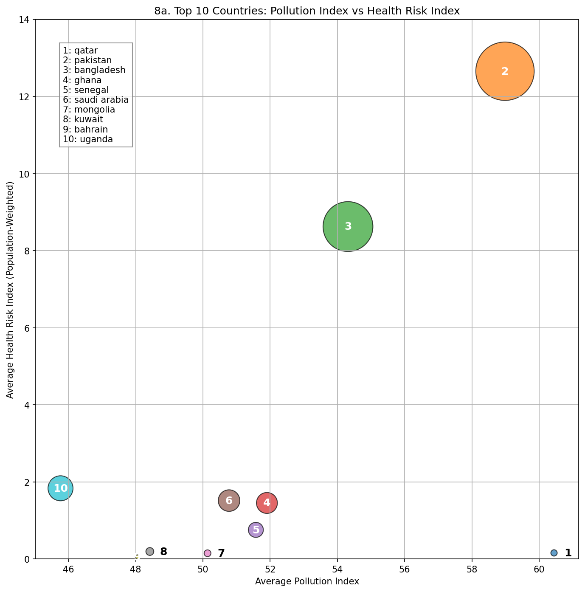
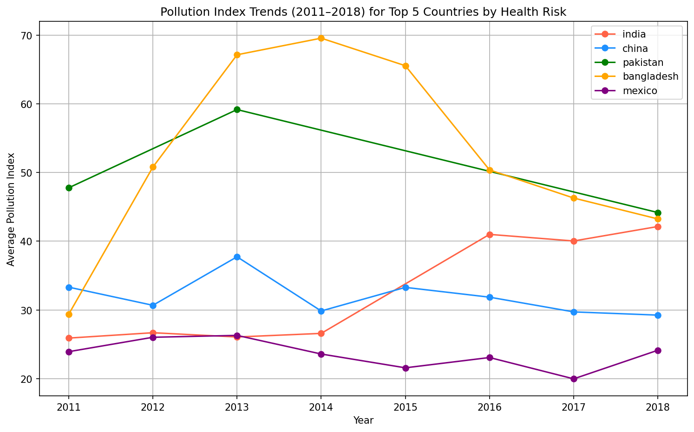
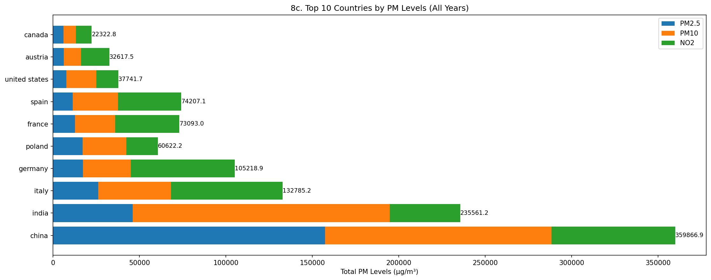

# Global Air Quality Analysis Using PySpark

## Overview

This project builds an end-to-end data pipeline in PySpark to analyse global air quality. It combines WHO city-level pollution measurements (PM2.5, PM10, NO2) with World Bank population data to produce two composite metrics: a Pollution Index and a population-weighted Health Risk Index. These allow cross-country and temporal comparisons that go beyond raw sensor readings and reflect actual population exposure.

The project was completed as part of an MSc Cloud Computing assignment and demonstrates scalable distributed data processing using Apache Spark.

---

## Repository Structure

```text
pyspark-air-quality/
├── Datasets/
│   ├── WHO Dataset.xlsx          # WHO Ambient Air Quality Database (2022 release)
│   └── POPULATION Dataset.csv    # World Bank country-level population data
├── outputs/
│   ├── bubble_chart.png          # Top 10 countries: Pollution Index vs Health Risk
│   ├── trend_chart.png           # Pollution trends 2011-2018 for top 5 countries
│   └── pm_bar_chart.png          # PM2.5 / PM10 / NO2 breakdown by country
├── Global Air Quality Analysis Using PySpark.ipynb
├── REPORT - Global Air Quality Analysis Using Spark.pdf
├── requirements.txt
└── README.md
```

---

## Visualisations

### Pollution Index vs Health Risk Index (Top 10 Countries)



### Pollution Trends 2011-2018 (Top 5 Countries by Health Risk)



### PM Levels by Country (All Years)



---

## Datasets

### WHO Ambient Air Quality Database

- Source: World Health Organization
- Format: Excel (.xlsx), sheet `AAP_2022_city_v9`
- Granularity: City-level measurements per year
- Key columns: country, city, measurement year, PM2.5, PM10, NO2 (µg/m3)
- Note: significant missingness in PM2.5 values, especially for earlier years

### World Bank Population Dataset

- Source: World Bank Open Data
- Format: CSV
- Granularity: Country-level population totals per year
- Key columns: country name, ISO code, year, population

---

## Pipeline

The full pipeline runs in a single Jupyter notebook across 8 steps.

**Step 1 - Data Ingestion**
The WHO Excel file is loaded via pandas (targeting the correct data sheet), written to a temporary CSV, then loaded into Spark. The population CSV is loaded directly. Both are stored as distributed DataFrames.

**Step 2 - Population Data Cleaning**
Column names are standardised to lowercase. String columns are trimmed and lowercased for consistent joining.

**Step 3 - Entity Resolution and Merge**
WHO country names are normalised using a lookup dictionary to fix known mismatches (e.g. "viet nam" to "vietnam", "russian federation" to "russia"). A left outer join on country name and year merges the two datasets while preserving all WHO rows.

**Step 4 - Validation**
Pollutant columns are renamed (pm25, pm10, no2). Missing value rates, duplicate counts, and value ranges are checked. No impossible values (negatives) were found.

**Step 5 - Advanced Cleaning**
Duplicates and rows missing key identifiers are removed. Missing population values are filled with per-country medians. Missing pollutant values are imputed using per-country medians. Row count after cleaning: 30,247.

**Step 6 - Feature Engineering**
Two metrics are calculated per row:

- Pollution Index: weighted average of available pollutants, adjusted by temporal coverage
- Health Risk Index: `(Pollution Index x Population) / 1,000,000,000`

Pollutants are also categorised as Low / Medium / High based on WHO thresholds.

**Step 7 - Final Validation**
Summary statistics and null counts are checked across key columns to confirm the dataset is clean and ready for analysis.

**Step 8 - Visualisations**
Three charts are generated and saved to the `outputs/` folder: a bubble chart, a line chart showing trends over time, and a stacked bar chart showing PM composition by country.

---

## How to Run

```bash
pip install -r requirements.txt
jupyter notebook "Global Air Quality Analysis Using PySpark.ipynb"
```

Run all cells from top to bottom. The three output charts will be saved to `outputs/`.

Java 8 or above is required for PySpark to run locally.

---

## Technologies

- Apache Spark (PySpark) for distributed data processing
- pandas and openpyxl for Excel ingestion
- matplotlib and numpy for visualisation
- Jupyter Notebook as the development environment

---

## Key Results

- Pakistan and Bangladesh show the highest combined pollution and health risk scores, driven by large populations and high PM levels.
- China has the highest total PM accumulation across all years, dominated by PM2.5.
- India leads on PM10 totals, reflecting dust, construction, and biomass burning.
- Bangladesh saw a sharp pollution peak around 2013-2014 followed by a decline.
- India is the only top-5 country showing a consistent upward trend through 2018.

---

## Contributors

| Name | DCU Student ID | Email |
| --- | --- | --- |
| Achal Nanjundamurthy | A00050840 | [achalnm02@gmail.com](mailto:achalnm02@gmail.com) |
| Tejas Shiva Kumar | A00050674 | [tejasshivakumar104@gmail.com](mailto:tejasshivakumar104@gmail.com) |
